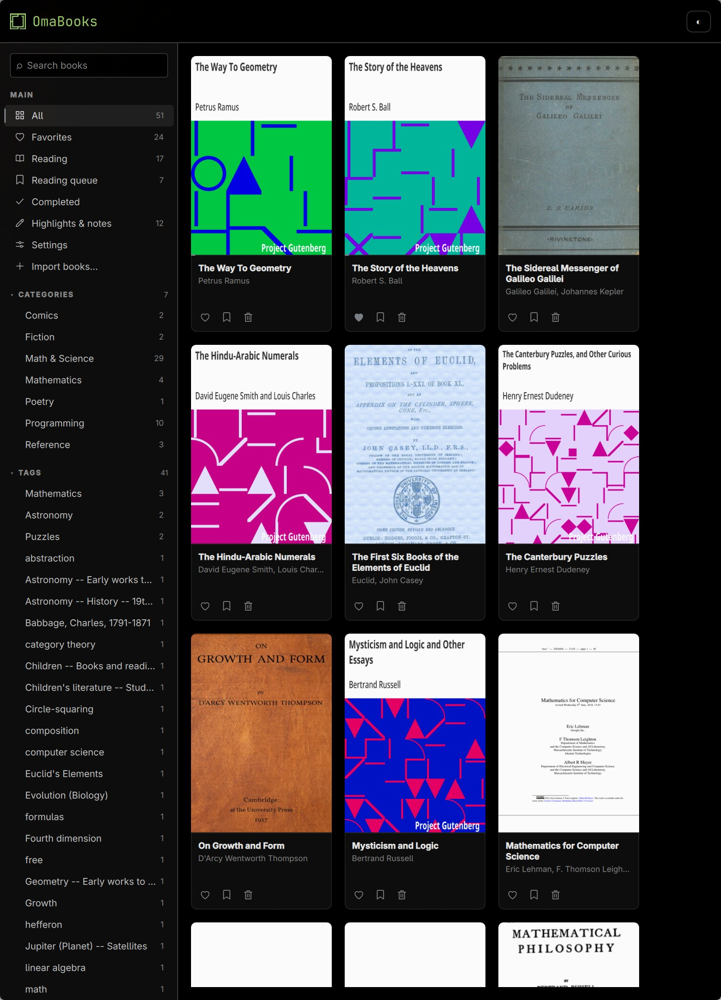
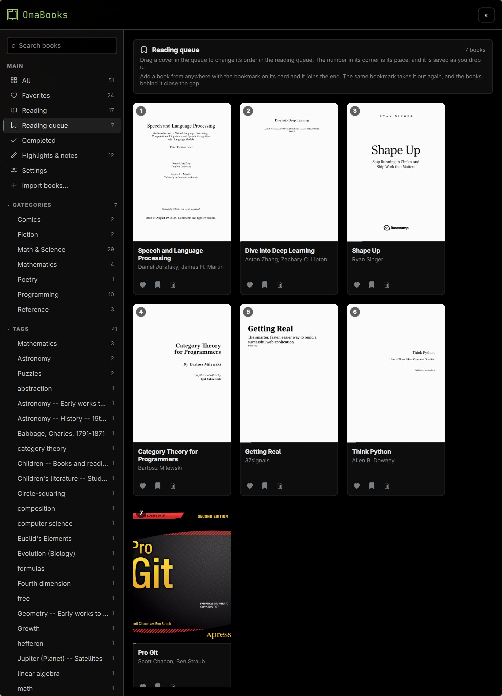
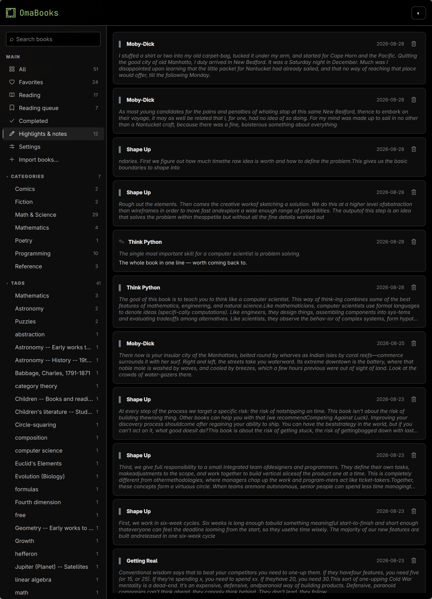
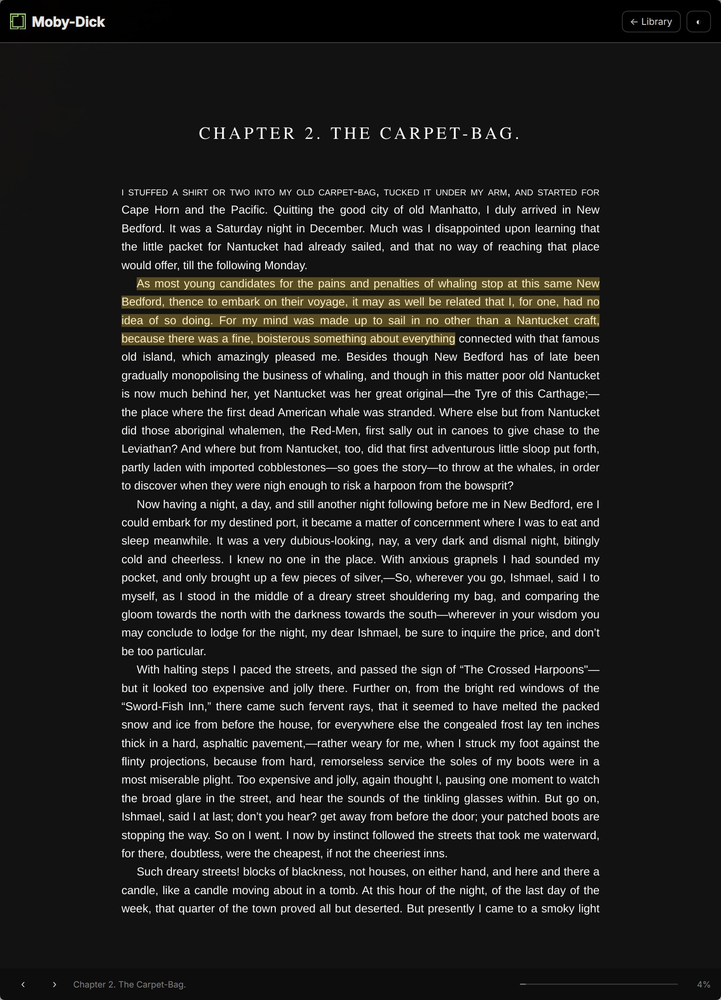
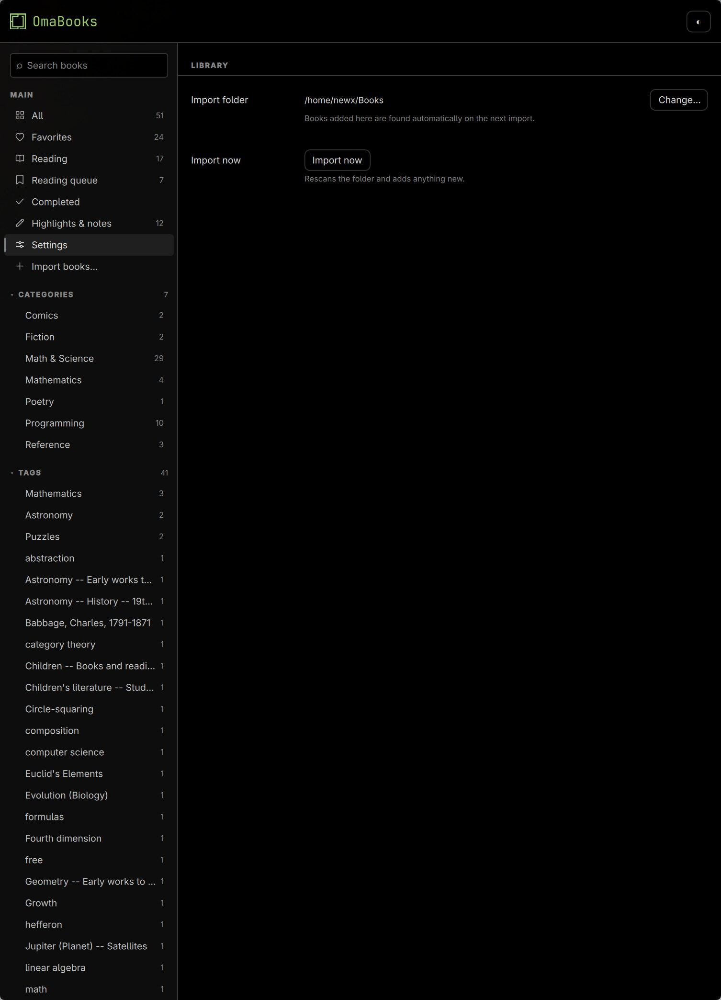

# OmaBooks

A book library and reader for Omarchy, built with Qt Quick and C++. Reads EPUB,
PDF, MOBI and AZW3, follows your system light/dark theme, and keeps your reading
position, highlights and notes as you go.

**This branch has no AI.** No assistant, no summaries, no question answering, no
reading aloud, and nothing that talks to a model or a speech service — see
*Two branches* below. It reaches the network for nothing at all: the books, the
database and the covers are local, and it behaves the same with the cable out.



## Install

Not yet in the Omarchy Package Repository, so it is built from source. Both
paths fetch the reader engine and build it for you.

**As a system package** — the Omarchy way, and what you want on Arch:

```bash
git clone https://github.com/newx/omabook-cplus.git omabook
cd omabook
./bin/install          # builds an Arch package and installs it
```

That asks for `sudo` once, at the end. Nothing in the build runs as root —
`makepkg` refuses to — but the finished package is installed with `pacman -U`,
which writes into `/usr`. In exchange, `pacman` knows what owns those files and
`pacman -R omabook` removes them cleanly.

**Into your home, with no root at all** — for another distribution, or a
machine where you would rather not touch `/usr`:

```bash
./bin/install-local    # ~/.local/bin, ~/.local/share
./bin/uninstall-local  # reverses it; your library is left alone
```

The two can coexist; the packaged install wins if both are present.

Then press `SUPER + SPACE` and type **OmaBooks**, or run `omabook`. Double
clicking an EPUB, MOBI or PDF opens it too.

`omabook --version` reports the branch, the revision, and the Qt it was built
against beside the Qt it is running on — worth having, because this application
has also existed as a Rust binary under the same name.

## Reading

Import a folder of books from the sidebar, or set a default folder in Settings
and import from there. Each book is read for its title, authors, description,
cover and subjects — EPUB metadata, MOBI/AZW3 headers, PDF info fields. Tags
are the subjects. The category is the folder a book sits in if you keep a
sorted library, otherwise it is worked out from the subjects and title offline,
with no model or lookup involved. Books with no signal at all stay
uncategorised rather than guessed.

| Action | How |
|---|---|
| Turn the page | the `‹` and `›` buttons, or `←`/`→`, `PageUp`/`PageDown`, `Space` |
| Highlight a passage | select text, then **Highlight** |
| Write a note | select text, then **Note** |
| Leave the book | `Escape`, or **← Library** |

Reading position, highlights and notes are saved as you go. Books move from
unread to reading on first open, and to finished near the end.

**Highlights work in PDFs**, which is less ordinary than it sounds: the reader
engine cannot paint annotations into a fixed-layout book at all, so OmaBooks
draws them itself, anchored to the words rather than to a position in the
document — a PDF's text layer is rebuilt on every render, and positions do not
survive that.

The sidebar holds **All**, **Favorites**, **Reading**, **Reading queue**,
**Completed** and **Highlights & notes**, plus a row for every category and
tag. The reading queue is the one list ordered by hand: drag a cover onto
another to move it.

Search is full text over title, authors, description, series and publisher,
matching as you type, so "mob" finds *Moby-Dick* before the word is finished.
Accents are folded, so "calculo" finds *Cálculo*. Punctuation never breaks it:
a stray quote or asterisk falls back to a substring match rather than erroring.

## Keybindings

The library is navigable without the mouse.

| Key | Where | Does |
|---|---|---|
| `s` | anywhere | Focus the sidebar |
| `l` | anywhere | Focus the book grid |
| `Ctrl+F` | anywhere | Focus the search field |
| `↑` `↓` | sidebar | Move between rows |
| `Enter` | sidebar | Open the focused row |
| `→` | sidebar | Cross to the books |
| `←` `→` `↑` `↓` | books | Move between covers |
| `←` | books, leftmost column | Cross back to the sidebar |
| `o`, `Enter` | books | Open the focused book |
| `f` | books | Favourite it |
| `q` | books | Put it in the reading queue |
| `d`, `Delete` | books | Remove it, behind a confirmation |
| `Escape` | anywhere | Leave the search field, or close the book |

Crossing back to the sidebar lands on the row already selected, so going across
and back does not quietly change what you are looking at.

Single-letter keys do nothing while you are typing in the search field, so
looking for *Shape Up* does not send you to the sidebar on the first keystroke.

In a book, `←`/`→`, `PageUp`/`PageDown` and `Space` turn pages, and `Escape`
returns to the library.

## Screens

### Reading queue

Drag a cover onto another to set the order. Each card carries its place, and
the order is saved as you drop it.



### Highlights and notes

Every highlight and note in the library, newest first, each one a way back into
the passage it came from.



### Reader

foliate-js inside the window with the app's own chrome around it: page turns,
progress, the chapter you are in, and the way back to the library. Highlights
are painted over the text, in PDFs as well as EPUBs.



### Settings

Where the library imports from. It is a short page, and deliberately so.



The images above are regenerated with `bin/screenshots`, which needs Wayland
and Hyprland — it launches each screen and crops the compositor's output to the
window.

## Requirements

Qt 6 (`qt6-base`, `qt6-declarative`, `qt6-webengine`, `qt6-webchannel`,
`qt6-imageformats`, `qt6-svg`), `poppler` for PDF covers and text, and
`xdg-desktop-portal` with a backend. There is nothing optional to install.

## Building

Qt 6 is the only build dependency, plus a clone of foliate-js in
`assets/reader/` — `bin/install` fetches it, or by hand:

```bash
git clone https://github.com/johnfactotum/foliate-js.git assets/reader/foliate-js
```

```bash
./bin/build          # release build, into build/
./bin/build --debug  # faster to compile, slower to run
./bin/test           # the core test suite
```

The scripts exist to resolve one thing: Arch ships qmake as `qmake6` and other
distributions ship it as `qmake`.

The source is two directories. `src/core` holds the library, the import
pipeline and search, and knows nothing about QML at all; `src/app` is the Qt
Quick front end on top of it. That separation is enforced by the test build's
module list rather than by convention — see [CLAUDE.md](CLAUDE.md), which is
also where the conventions and the traps are written down.

If the package is installed, note that `/usr/share/omabook/reader` takes
precedence over the copy in your source tree, so a change to the reader needs a
reinstall — or point `OMABOOK_READER_DIR` at the checkout.

## Two branches

`main-with-ai-features` is the full application: an assistant in the reader,
questions answered from the whole library, page summaries, and reading aloud
with automatic page turns.

**This branch removes all of it**, and it is a real reduction rather than a
hidden switch. Around 4,200 lines of C++ and three QML screens are gone, along
with the dependencies on `qt6-multimedia`, `qt6-multimedia-ffmpeg` and
`qt6-speech`. Migration 006 drops the embedding and summary tables too, which on
a fully indexed library took the database from 45 MB to 212 KB.

That migration is one-way: a library opened here loses its embeddings, and
re-indexing on the other branch costs roughly two minutes a book. Everything
else is shared, so a book, a bookmark, a highlight or a note written on either
branch reads fine on the other.

## History

A port of [omabook](https://github.com/newx/omabook) from Rust and cxx-qt to
C++ and Qt 6, so that it is built the way [omawrite](https://github.com/omacom-io/omawrite)
and the rest of the `oma*` family are — one `.pro`, one `make`, one binary. It
reached parity with the Rust version, and then had its AI features removed on
this branch.

[SPEC.md](SPEC.md) says what it is meant to be and records what changed in the
move; [TODO.md](TODO.md) tracks what is done and what is not.

## Acknowledgements

Reading is handled by [foliate-js](https://github.com/johnfactotum/foliate-js),
the engine behind the Foliate reader, which covers EPUB, MOBI, AZW3, FB2, CBZ
and PDF behind one API.

The build and house style follow
[omawrite](https://github.com/omacom-io/omawrite) by omacom-io.

## Author

Newton Ramos Garcia, [newx.sh](https://newx.sh) ·
[@newx](https://github.com/newx)

## License

MIT. See [LICENSE](LICENSE).
